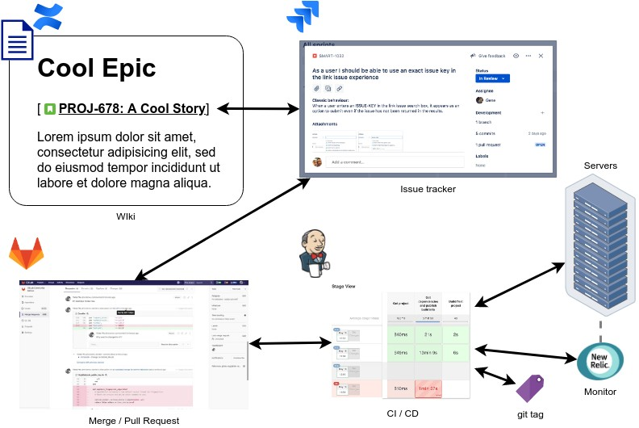
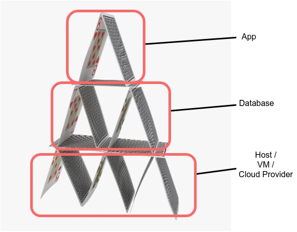

# The problem with traditional approach
We've all been there - we have a bunch of apps, databases, servers, across many environments, and none of them seem to be in-sync.

Spinning up new environment takes days at best, and are extremely labour intensive.

When we finally fire it up, it doesn't work properly - because we've mistyped something / missed a setup step...

Oh, and sometimes, things break "randomly", and we have no idea what caused it.

# We want speed, and consistency!
Yes, sure!  We can have our cake and eat it!

There are 3 things we must put in place:
1. [Plan before do - document along the way](#plan-before-do---document-along-the-way)
2. [Consistent State across the entire stack](#consistent-state-across-the-entire-stack)
3. [Automation for consistency at speed](#automation-for-consistency-at-speed)

## Plan before do - document along the way
If you've struggled to find out why / how something was changed, when presented with questions / issues, this will help.

The key is **bi-direction audit, embedded into process + tools**; audit happens automatically as part of the development process / with minimal manual intervention.

Documenting things from the start puts us in a great position; we can continuously tie our plan and work, between issue tracker, code review tool, CI/CD pipeline, and eventually to a deployment.

It's important to assume zero prior knowledge in our documents; another person will need to understand why and what you've done at the time.

Oh, that person may be you, years down the road...

## Consistent State across the entire stack
For users to access our apps, everything must work properly.

We should think of and manage our application stack holistically; our apps, database, host / VMs / Cloud Provider must be configured to a **state** that allows our users to access our apps.

Think of it like a house of cards; if any part of the stack is not configured correctly and fails, the whole thing fails (or at least no longer operating properly).

So, our application stack's operational **state** is extremely important, and we must be able to **guarantee** that state.

## Automation for consistency at speed
Modern applications are complex, and they require a lot of moving parts over many places to run.

To ensure we can reproduce things consistently, and to do so quickly, we **must** rely on automation as much as we can.

Remember, computers almost never make mistakes.

Humans do, all the time.

# I'm on board, what's next?
In the next post, we'll stand-up a very simple environment to run a very simple application.

We'll experience the power of automation, to quickly and consistently spin-up our environment and app.

As we progress, we'll add more features to our stack, and keep pushing our knowledge.
